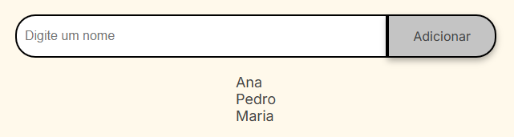
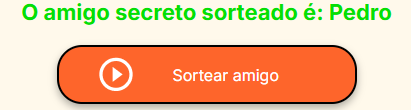

<h1 align="center">Amigo Secreto</h1>

<h2>Como funciona</h2>

1. O usuário digita um nome no campo de texto e clica em Adicionar.

°O nome é salvo no array `amigos`.

°A lista abaixo é atualizada dinamicamente.

2. Se o campo estiver vazio → aparece um alerta *"Por favor, insira um nome válido!"*.

3. Ao clicar em Sortear amigo:

°O código valida se a lista não está vazia.

°Gera um número aleatório com `Math.random()` e `Math.floor()`.

°Pega o nome correspondente no array.

°Exibe o sorteado dentro da `<ul id="resultado">`.

<h2>Exemplos</h2>

*Exemplo 1: adicionando amigos*

O usuário digita:

    "Ana" → clica em Adicionar

    "Pedro" → clica em Adicionar

    "Maria" → clica em Adicionar

*Exemplo 2: sorteio*

O usuário clica em Sortear amigo.

O programa gera um número aleatório entre 0 e 2.

° Possibilidades:

    Se gerar 0 → "Ana".

    Se gerar 1 → "Pedro".

    Se gerar 2 → "Maria".

<h2>Tecnologias usadas</h2>

JavaScript Puro (Vanilla JS) → manipulação do DOM (`document.getElementById`, `createElement`, `appendChild`).

*Math.random()* e *Math.floor()* para gerar o índice aleatório.

<h2>Acesse o projeto</h2>
Jogo do amigo secreto: https://amigo-secreto-woad-tau.vercel.app/
